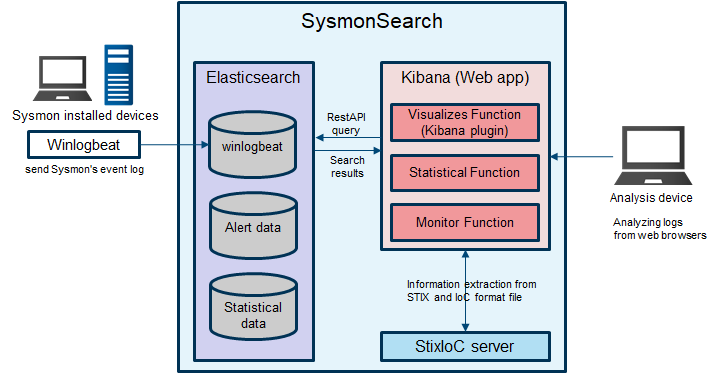

# SysmonSearch

  SysmonSearch make event log analysis more effective and less time consuming, by aggregating event logs generated by Microsoft's Sysmon.

    

## System Overview
  SysmonSearch uses Elasticserach and Kibana (and Kibana plugin).
  * **Elasticserach**  
    Elasticsearch collects/stores Sysmon's event log.
  * **Kibana**  
    Kibana provides user interface for your Sysmon's event log analysis. The following functions are implemented as Kibana plugin.
    * Visualizes Function  
      This function visualizes Sysmon's event logs to illustrate correlation of processes and networks.
    * Statistical Function  
      This function collects the statistics of each device or Sysmon's event ID.
    * Monitor Function  
      This function monitor incoming logs based on the preconfigured rules, and trigers alert.
  * **StixIoC server**  
    You can add search/monitor condition by uploading STIX/IOC file. From StixIoC server Web UI, you can upload STIXv1, STIXv2 and OpenIOC format files.

## Use SysmonSearch
  To try SysmonSearch, you can either 1)install softwares to your own linux enviroment with following instractions or 2)use docker image:
  1. [Install to your own linux box](https://github.com/JPCERTCC/SysmonSearch/wiki/How-to-Install)
  2. [Use docker image](https://github.com/JPCERTCC/SysmonSearch/wiki/Jump-start-with-Docker)

## Documentation  
For details, please check [the SysmonSearch wiki](https://github.com/JPCERTCC/SysmonSearch/wiki).
